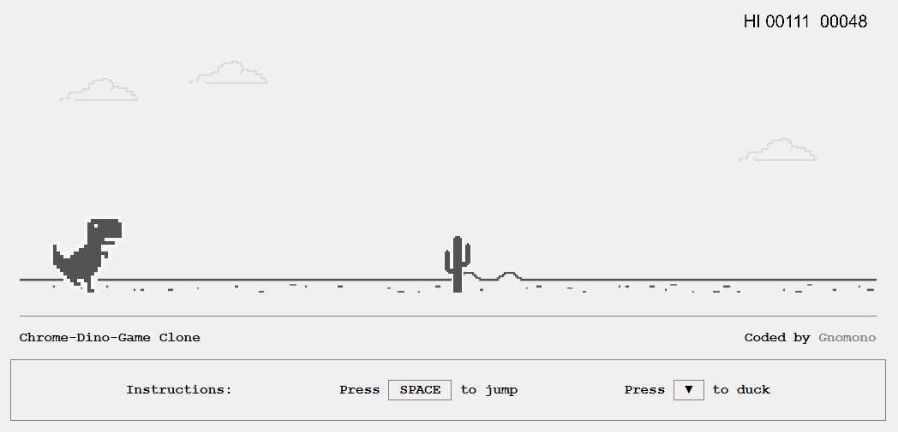

# Dino Game Clone – Phaser + Webpack Boilerplate



Este proyecto es un clon del clásico Dino Game de Chrome, desarrollado con [Phaser 3.60](https://phaser.io/) y empaquetado con Webpack 5. Está diseñado para ser modular, escalable y fácil de mantener, ideal para desarrolladores que buscan una base sólida para juegos 2D en el navegador.

## Características

- Motor de juego: Phaser 3.60
- Configuración moderna con Webpack (dev, prod, y variantes personalizadas)
- Limpieza automática de builds con `clean-webpack-plugin`
- Copia de assets con `copy-webpack-plugin`
- Soporte para Babel y TypeScript
- Generación automática de HTML con `html-webpack-plugin`
- Minificación con `terser-webpack-plugin`

## 📁 Estructura del Proyecto

    ├── src/                          # Código fuente del juego
    │   ├── assets/                   # Imágenes, sonidos, fuentes
    │   │   ├── images/               # Sprites, fondos, etc.
    │   │   └── audio/                # Efectos de sonido, música
    │   ├── scenes/                   # Escenas del juego
    │   │   ├── BootScene.ts          # Pre-carga y configuración inicial
    │   │   ├── PreloadScene.ts       # Carga de assets
    │   │   ├── GameScene.ts          # Lógica principal del juego
    │   │   └── GameOverScene.ts      # Pantalla de fin de juego
    │   ├── config/                   # Configuración general del juego
    │   │   └── gameConfig.ts         # Tamaño, física, etc.
    │   ├── objects/                  # Clases de objetos del juego (Dino, Obstáculos)
    │   │   ├── Dino.ts               # Lógica del personaje principal
    │   │   └── Obstacle.ts           # Lógica de los obstáculos
    │   └── index.ts                  # Punto de entrada del juego
    ├── index.html                    # HTML base generado por Webpack
    ├── package.json                  # Configuración de dependencias y scripts
    ├── tsconfig.json                 # Configuración de TypeScript
    ├── webpack.common.js             # Configuración compartida de Webpack
    ├── webpack.prod.js               # Configuración para producción
    ├── webpack.fb.js                 # Configuración alternativa (ej. Facebook)
    └── README.md                     # Documentación del proyecto

## Scripts disponibles

```bash
# Ejecuta el servidor de desarrollo
npm run dev

# Ejecuta el servidor con configuración alternativa (ej. Facebook)
npm run dev-fb

# Compila para producción
npm run build  
```

## Instalación

1. Clona el repositorio:

```bash
git clone https://github.com/tu-usuario/phaser-webpack-boilerplate.git
cd phaser-webpack-boilerplate
```

2. Instala las dependencias:

```bash
npm install
```

3. Ejecuta el entorno de desarrollo:

```bash
npm run dev
```

## Estado del juego  

- ✅ Movimiento del Dino
- ✅ Obstáculos con colisión
- ✅ Sistema de puntuación
- ✅ Game Over y reinicio
- ✅ Sonido y animaciones adicionales
